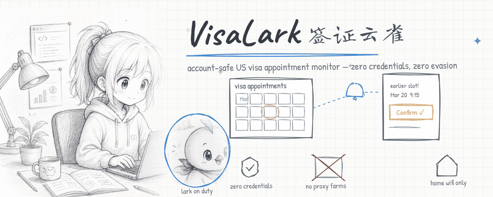

<div align="center">



# VisaLark · 签证云雀

[English](./README.md) · [日本語](./README.ja.md) · **한국어** · [中文](./README.zh.md)

**오픈소스이며 계정에 안전한 미국 비자 예약 모니터. 비밀번호를 저장하지 않고, CAPTCHA를 우회하지 않으며, 프록시 군비 경쟁에 뛰어들지 않습니다.**

[]() [](./LICENSE) []()

[기능](#-기능) · [계정을 보호하는 방식](#%EF%B8%8F-계정을-보호하는-방식) · [설치](#-설치) · [qmq와 비교](#-솔직한-비교) · [면책 조항](#%EF%B8%8F-면책-조항)

</div>

---

## 이것은 무엇인가

VisaLark는 `ais.usvisa-info.com`(CGI Federal)에서 <strong>당신 자신</strong>의 비자 예약 가능 슬롯을 모니터링합니다. 조건에 맞는 슬롯이 발견되면 WeChat / iOS / Telegram으로 <strong>즉시 푸시</strong>하고, 선택적으로 <strong>원탭 예약 변경</strong> 또는 엄격한 안전 잠금 하에 <strong>자동 예약 변경</strong>이 가능합니다.

할 수 있는 것과 할 수 없는 것을 <strong>솔직하게</strong> 알려줍니다:

- ✅ 놓쳤을 슬롯을 잡아냅니다 —— 특히 덜 붐비는 영사관, 더 이른 임의의 날짜, 긴급 슬롯 등.
- ✅ 여러 영사관을 동시에 감시하고 "수용 가능한 도시 중 가장 이른 슬롯"을 잡습니다.
- ✅ 계정 안전 최우선: 브라우저에 이미 로그인된 세션을 재사용합니다. 비밀번호를 저장하지 않고, 핑거프린트를 위조하지 않으며, CAPTCHA를 우회하지 않습니다.
- ❌ 가장 인기 있는 슬롯을 "초 단위로 확보"하는 것은 <strong>약속하지 않습니다</strong>. 30초 안에 사라지는 그런 슬롯은 유료 주거용 프록시 클러스터로만 이길 수 있습니다 —— 그것은 qmq가 매월 막대한 비용을 쓰고, 유료화를 강요받으며, 계정 정지와 저장소 삭제를 초래하는 군비 경쟁입니다. <strong>우리는 그 싸움에 참여하지 않습니다.</strong>

> 왜 이렇게 설계했나? [계정을 보호하는 방식](#%EF%B8%8F-계정을-보호하는-방식)을 참조하세요. 전체 위협 모델은 [DESIGN.md](./DESIGN.md)에 있습니다.

## ✨ 기능

| 기능 | 설명 |
|------|------|
| 🎯 **여러 영사관 중 최단 슬롯** | 하나의 모니터로 여러 영사관을 감시하고 필터에 맞는 가장 이른 날짜를 자동 선택 |
| 🔔 **원탭 확인** | 푸시에 버튼이 포함되어, 탭하면 로그인된 웜 세션으로 1초 미만에 예약 변경(휴먼 인 더 루프, 규정 준수) |
| 🤖 **자동 예약 변경(선택)** | 기본 비활성화. 활성화 시 다중 잠금으로 보호: 더 이른 슬롯만 · 허용된 영사관만 · 처음 N회는 수동 확인 · 일일 상한 · 킬 스위치 · 드라이런 |
| 📅 **날짜 / 요일 / 시간대 필터** | 수용 가능한 범위에서만 알림하여 소음 제거 |
| 📡 **다채널 알림** | Bark(iOS) · ServerChan(WeChat) · Telegram · Webhook(WeCom/Discord) · 브라우저 네이티브. 높은 우선순위는 모든 채널에 동시 발송 |
| 🚑 **긴급 슬롯 모니터링** | 긴급 출국을 위해 expedite 캘린더 감시 |
| 🔑 **세션 상태 점검** | 세션 만료 / 챌린지 감지 → 즉시 중단하고 재동기화 요청. 절대 강행하지 않음 |
| 📊 **가용 이력 + 히트맵** | 선택적 컨트롤 패널이 가용 이력을 기록하고 "어떤 시간대에 슬롯이 가장 자주 풀리는지" 학습 |

## 🛡️ 계정을 보호하는 방식

미국 비자 시스템은 <strong>사용자별 행동 ML</strong> + Cloudflare + reCAPTCHA를 사용합니다. 가장 치명적인 정지 신호는 폴링 빈도가 <strong>아니라</strong> <strong>ASN / 불가능한 이동의 불일치</strong>입니다:

> 주거용 네트워크에서 로그인했는데 같은 세션이 미국 데이터센터 IP에서 `/days/*.json`을 호출한다 —— 이는 교과서적인 "계정 탈취 / 자동화" 시그니처이며, <strong>당신의 실제 비자 계정을 빠르게 정지</strong>시킵니다(이의 제기는 느리고, 여행을 놓치고, 비자 수수료를 날릴 수 있음).

그래서 VisaLark는 <strong>2계층 아키텍처</strong>를 사용합니다:

```
┌─── 당신의 주거용 네트워크(데이터 플레인: 비자 사이트에 닿는 유일한 부분) ───┐
│  브라우저 확장(권장, 초보자 친화적)  또는  로컬 Agent(24x7 긱용)            │
│  → 실제 로그인 세션 · 주거용 IP · 실제 브라우저 핑거프린트 재사용             │
│  → 비밀번호 저장 0 · CAPTCHA 해독 0 · 프록시 0                              │
└──────────────────────────────┬──────────────────────────────────────────┘
                               │ (선택) 가용 이력 보고 / 알림 중계
                               ▼
┌──────── 컨트롤 패널(비자 사이트에 닿지 않음 · 자격 증명 0)────────┐
│  Vercel 랜딩/문서/데모   +   무료 서버(Oracle Free)에서                  │
│  이력 / 히트맵 / 알림 중계                                                │
└──────────────────────────────────────────────────────────────────┘
```

3가지 <strong>철칙</strong>(코드에 내장, 테스트로 보호):

1. **데이터 플레인은 주거용 IP에서만 실행** —— Agent는 송신 IP를 확인하고 데이터센터 ASN을 감지하면 기본적으로 시작을 거부합니다.
2. **우회 코드 0** —— 프록시 로테이션 없음, TLS 위조 없음, CAPTCHA 해독 없음. 이것은 <strong>법적 방패</strong>이자 <strong>계정 방패</strong>입니다.
3. **실패 즉시 중단** —— 챌린지 / 401 / 1015를 만나면 즉시 중단하고 사람에게 알립니다. 절대 강행하지 않습니다.

## 📦 설치

### 방법 A: 브라우저 확장(권장, 대다수 사용자용)

1. [Releases](https://github.com/appleweiping/visa-lark/releases)에서 확장을 다운로드하거나 직접 빌드:
   ```bash
   pnpm install && pnpm --filter @visa-lark/extension build
   # dist는 apps/extension/dist —— Chrome/Edge → 확장 프로그램 → 압축해제된 확장 프로그램 로드
   ```
2. <strong>당신 자신의 브라우저</strong>에서 `ais.usvisa-info.com`에 로그인하고 예약/예약 변경 페이지를 엽니다.
3. 확장 아이콘 클릭 → "현재 세션 동기화"(영사관과 스케줄 ID를 자동으로 읽음 · 수동 입력 불필요).
4. 설정에서 모니터(영사관, 비자 종류, 날짜 범위, 모드)와 알림 채널을 추가합니다.
5. 완료. 확장은 백그라운드에서 당신의 세션을 사용해 지터가 적용된 일정으로 확인하고, 슬롯이 나오면 푸시합니다.

### 방법 B: 로컬 Agent(긱용 —— 브라우저를 계속 열어두지 않고 24x7)

```bash
pnpm install && pnpm --filter @visa-lark/agent build
cp apps/agent/visalark.config.example.json apps/agent/visalark.config.json
# 편집: 로그인된 브라우저에서 내보낸 _yatri_session cookie + 영사관 + 스케줄 ID + 채널을 붙여넣기
node apps/agent/dist/index.js apps/agent/visalark.config.json
```

> ⚠️ <strong>집 네트워크</strong>(가정용 PC / 라즈베리 파이)에서 실행하세요. 클라우드 서버에서는 <strong>실행하지 마세요</strong> —— 위의 안전 모델 참조. Agent는 데이터센터 IP를 자동 감지하고 시작을 거부합니다.

### 선택: 컨트롤 패널(이력 / 히트맵 / 알림 중계 · 자격 증명 0)

무료 [Oracle Cloud Always Free](https://www.oracle.com/cloud/free/) VM에 배포하고, 랜딩/문서는 Vercel에 배포합니다. 자세한 내용은 [apps/control-plane/README](./apps/control-plane)와 [DESIGN.md](./DESIGN.md) 참조.

## 🤝 솔직한 비교

| | **VisaLark** | qmq.app | OSS visa_rescheduler 계열 |
|--|--|--|--|
| 오픈소스 | ✅ Apache-2.0 | ❌ 비공개 | ✅ |
| 가격 | 무료 | 유료 VIP | 무료 |
| 계정 안전성 | ✅ 주거용 IP + 실제 세션 재사용 | ⚠️ 프록시 클러스터, 속도 제한 / 리스크 통제에 걸릴 수 있음 | ⚠️ 데이터센터에서 실행되는 경우가 많아 정지 위험 |
| 비밀번호 저장 | ❌ 절대 안 함 | ? | ⚠️ 평문 저장이 흔함 |
| CAPTCHA/프록시 우회 | ❌ 우회 0 | ✅ 군비 경쟁에 돈을 씀 | ⚠️ 일부 |
| 중국 도달 알림 | ✅ WeChat/Bark | ⚠️ Telegram만 | ⚠️ 주로 Telegram/이메일 |
| 가장 인기 있는 순삭 슬롯 확보 | ❌ 약속하지 않음(솔직) | ✅ 핵심 기능(프록시 클러스터로) | ❌ |
| 다채널 + 원탭 확인 + 잠금 | ✅ | 일부 | ❌ |

<strong>한 줄로</strong>: "더 이른 슬롯 / 덜 붐비는 영사관 / 긴급 슬롯"을 원한다면 VisaLark는 무료, 오픈소스이며 당신을 BAN당하게 하지 않습니다. 30초 만에 사라지는 최상위 순삭 슬롯을 고집한다면, 책임 있는 셀프 호스팅 도구로는 그 싸움에서 이길 수 없습니다 —— 그것은 BAN 위험을 떠안는 유료 사업자의 싸움입니다. 우리는 그것에 대해 거짓말하지 않습니다.

## 🧩 모노레포

```
packages/shared              # 어댑터 비의존 코어: 타입 + 엔진 + 안전 + 잠금 + 알림 인터페이스(36 tests)
packages/adapter-usvisa-info # usvisa-info에 닿는 유일한 코드: 엔드포인트/파싱/예약변경/실패즉시중단(16 tests)
packages/notify              # Bark / ServerChan / Telegram / Webhook 채널(5 tests)
apps/extension               # MV3 브라우저 확장(주 데이터 플레인 · 초보자 친화적; 15 tests)
apps/agent                   # 로컬 Node Agent(긱용 데이터 플레인 · 주거용 IP 보호; 7 tests)
apps/control-plane           # Fastify + better-sqlite3 컨트롤 패널(자격 증명 0, 22 tests)
apps/web                     # Next.js 랜딩/문서/데모(Vercel에 배포)
```

## ⚖️ 면책 조항

VisaLark는 <strong>교육 및 개인 용도</strong>의 오픈소스 도구이며, <strong>CGI Federal이나 미국 국무부와 일절 관련이 없습니다</strong>.

- 본 도구로 비자 시스템에 접근하는 것은 <strong>이용 약관을 위반할 수 있으며</strong>, 자동화 접근은 <strong>비자 계정의 제한 또는 정지를 초래할 수 있습니다</strong>. <strong>계정 및 법적 위험은 모두 본인 책임입니다.</strong>
- 본 프로젝트에는 <strong>CAPTCHA 우회 / 봇 차단 우회 / 프록시</strong> 코드가 <strong>일절 포함되지 않으며</strong>, 멀티테넌트 호스팅을 <strong>명확히 금지</strong>합니다(누구의 비자 자격 증명도 보관하지 않음).
- 본 프로젝트는 호스팅 서비스를 <strong>제공하지 않으며</strong>, 어떤 예약 확보도 <strong>약속하지 않습니다</strong>.
- 이는 법적 조언이 아닙니다. 상업적 또는 호스팅 용도 전에 변호사와 상담하세요.
- `auto` 예약 변경은 파괴적 작업(기존 예약을 대체)이며 기본 비활성화입니다 —— 활성화 전에 모든 잠금을 이해하세요.
- **예약 변경/예약 기능은 실험적**입니다: usvisa-info의 예약 변경 폼 필드와 확인 흐름은 실제 계정에서 완전히 검증되지 않았습니다. 결과가 불명확할 때 도구는 `failed`로 표시하고 <strong>수동 확인</strong>을 요청하며, 성공을 가장하지 않습니다. 모니터링/알림이 핵심이며 가장 신뢰할 수 있는 부분입니다. 자동/원탭 예약 변경은 먼저 <strong>드라이런 모드</strong>로 검증하세요.

[Apache-2.0](./LICENSE) 라이선스. No warranty.

---

<div align="center">
<sub>Built with 🐦 by the VisaLark contributors · 계정 안전 > 확보 속도</sub>
</div>
