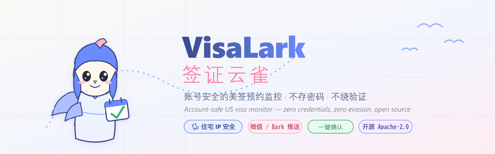

<div align="center">



# VisaLark · 签证云雀

**开源、账号安全的美签预约监控工具。不存密码，不绕验证码，不打代理军备竞赛。**

*Open-source, account-safe US visa appointment monitor. Zero stored credentials. Zero evasion. No proxy arms race.*

[]() [](./LICENSE) []()

[功能](#-功能-features) · [它如何保护你的账号](#-它如何保护你的账号-the-safety-model) · [安装](#-安装-install) · [对比 qmq](#-诚实对比-honest-comparison) · [免责声明](#%EF%B8%8F-免责声明-disclaimer)

</div>

---

## 这是什么 What is this

VisaLark 监控 `ais.usvisa-info.com`（CGI Federal）上你<strong>自己</strong>的签证预约可约位，发现符合条件的位就<strong>立即推送</strong>到你的微信 / iOS / Telegram，并可选<strong>一键确认改期</strong>或在严格安全锁下<strong>自动改期</strong>。

它<strong>诚实</strong>地告诉你它能做什么、不能做什么：

- ✅ 帮你抓住本会错过的可约位 —— 尤其是不那么火爆的领区、任意更早日期、加急/紧急位。
- ✅ 多领区同时盯，取"我能接受的城市里最早的位"。
- ✅ 账号安全第一：复用你浏览器里已登录的会话，从不存密码、从不伪造指纹、从不绕验证码。
- ❌ <strong>不</strong>承诺"秒级抢到"最火爆的位。那种 30 秒内消失的位，只有靠付费住宅代理 IP 集群才能赢 —— 那是 qmq 月烧十万、被迫收费、且会让账号被封、让仓库被下架的军备竞赛。<strong>我们不打这场仗。</strong>

> 为什么这样设计？见 [它如何保护你的账号](#-它如何保护你的账号-the-safety-model)。完整威胁模型在 [DESIGN.md](./DESIGN.md)。

## ✨ 功能 Features

| 功能 | 说明 |
|------|------|
| 🎯 **多领区最早位** | 一个监控盯多个领区，自动取符合过滤条件的最早日期 |
| 🔔 **一键确认** | 推送里带按钮，点一下用已登录的热会话 <1s 完成改期（人在回路，合规） |
| 🤖 **自动改期（可选）** | 默认关闭。开启后受多重安全锁：只换更早的位、只去允许的领区、前 N 次需人工确认、每日上限、总开关、演练模式 |
| 📅 **日期 / 星期 / 时段过滤** | 只在你能接受的窗口内提醒，杜绝噪音 |
| 📡 **多渠道通知** | Bark(iOS) · Server酱(微信) · Telegram · Webhook(企业微信/Discord) · 浏览器原生。高优先级同时推所有渠道 |
| 🚑 **加急/紧急位监控** | 监控 expedite 日历，紧急出行可用 |
| 🔑 **会话健康检测** | 会话过期 / 被验证拦截 → 立即停手并提醒你重新同步，绝不硬闯 |
| 📊 **可约历史 + 热力图** | 可选控制面板记录可约历史，算出"哪个时段最常放位"（放位规律学习） |

## 🛡️ 它如何保护你的账号 The safety model

美签系统用<strong>按用户的行为 ML</strong> + Cloudflare + reCAPTCHA。最致命的封号信号<strong>不是</strong>轮询频率，而是 <strong>ASN / 不可能旅行 不匹配</strong>：

> 你从中国住宅网络登录，结果同一个会话却从一个美国机房 IP 去刷 `/days/*.json` —— 这是教科书级的"账号被盗用/自动化"特征，会<strong>很快封掉你真实的签证账号</strong>（申诉慢，可能错过行程、白交签证费）。

所以 VisaLark 采用<strong>两层架构</strong>：

```
┌─── 你的住宅网络（数据面：唯一接触签证网站的部分）────┐
│  浏览器扩展（推荐，小白友好）  或  本地 Agent（极客 24x7）  │
│  → 复用你真实的登录会话、住宅 IP、真浏览器指纹              │
│  → 零密码存储、零验证码破解、零代理                         │
└──────────────────────────────┬──────────────────────────┘
                               │ (可选) 上报可约历史 / 中转通知
                               ▼
┌──────── 控制面板（不接触签证网站、零凭证）────────┐
│  Vercel 落地页/文档/Demo   +   免费服务器(Oracle Free) 跑     │
│  历史/热力图/通知中转                                          │
└──────────────────────────────────────────────────────────┘
```

三条<strong>硬规矩</strong>（写进代码、有测试守护）：

1. **数据面只在住宅 IP 跑** —— Agent 会检测出口 IP，识别到机房 ASN 默认拒绝启动。
2. **零绕过代码** —— 不轮换代理、不伪造 TLS、不破解验证码。这既是<strong>法律护盾</strong>也是<strong>账号护盾</strong>。
3. **失败即停手** —— 遇到验证拦截 / 401 / 1015，立即停止并提醒人工处理，绝不硬闯。

## 📦 安装 Install

### 方式一：浏览器扩展（推荐，适合大多数人）

1. 下载 [Releases](https://github.com/appleweiping/visa-lark/releases) 里的扩展包，或自行构建：
   ```bash
   pnpm install && pnpm --filter @visa-lark/extension build
   # dist 目录在 apps/extension/dist，Chrome/Edge → 扩展程序 → 加载已解压的扩展程序
   ```
2. 在<strong>你自己的浏览器</strong>里正常登录 `ais.usvisa-info.com`，进入预约/改期页面。
3. 点扩展图标 → "同步当前会话"（自动读取领区和行程号，无需手填）。
4. 在设置页添加监控（领区、签证类型、日期范围、模式）和通知渠道。
5. 完事。扩展会在后台用你的会话定时、带抖动地检查，发现位就推送。

### 方式二：本地 Agent（极客，24x7 不用一直开浏览器）

```bash
pnpm install && pnpm --filter @visa-lark/agent build
cp apps/agent/visalark.config.example.json apps/agent/visalark.config.json
# 编辑：粘贴你从已登录浏览器导出的 _yatri_session cookie + 领区 + 行程号 + 通知渠道
node apps/agent/dist/index.js apps/agent/visalark.config.json
```
> ⚠️ 在<strong>你家里的网络</strong>跑（家用电脑/树莓派），<strong>不要</strong>跑在云服务器上 —— 见上面的安全模型。Agent 会自动检测并拒绝在机房 IP 上启动。

### 可选：控制面板（历史/热力图/通知中转，零凭证）

部署在免费的 [Oracle Cloud Always Free](https://www.oracle.com/cloud/free/) VM 上，落地页/文档部署在 Vercel。详见 [apps/control-plane/README](./apps/control-plane) 和 [DESIGN.md](./DESIGN.md)。

## 🤝 诚实对比 Honest comparison

| | **VisaLark** | qmq.app | 开源 visa_rescheduler 系 |
|--|--|--|--|
| 开源 | ✅ Apache-2.0 | ❌ 闭源 | ✅ |
| 价格 | 免费 | VIP 付费 | 免费 |
| 账号安全 | ✅ 住宅 IP + 复用真会话 | ⚠️ 代理集群，可能限速/触发风控 | ⚠️ 多在机房跑，封号风险 |
| 存你的密码 | ❌ 从不 | ? | ⚠️ 常存明文 |
| 绕验证码/代理 | ❌ 零绕过 | ✅ 烧钱打军备竞赛 | ⚠️ 部分 |
| 国内通知 | ✅ 微信/Bark | ⚠️ 仅 Telegram | ⚠️ 多为 Telegram/邮件 |
| 抢最火爆的秒杀位 | ❌ 不承诺（诚实） | ✅ 主打（靠代理集群） | ❌ |
| 多渠道 + 一键确认 + 安全锁 | ✅ | 部分 | ❌ |

<strong>一句话</strong>：如果你要的是"任意更早的位 / 不那么挤的领区 / 加急位"，VisaLark 免费、开源、不会害你封号。如果你非要抢那种 30 秒消失的顶级秒杀位，没有任何负责任的自托管工具能赢那场仗 —— 那是付费运营方背着封号风险去打的。我们诚实地不骗你。

## 🧩 架构 Monorepo

```
packages/shared              # 适配器无关的核心：类型 + 引擎 + 安全 + 联锁 + 通知接口（49 tests）
packages/adapter-usvisa-info # 唯一接触 usvisa-info 的代码：端点/解析/改期/失败即停（16 tests）
packages/notify              # Bark / Server酱 / Telegram / Webhook 渠道（5 tests）
apps/extension               # MV3 浏览器扩展（主数据面，小白友好）
apps/agent                   # 本地 Node Agent（极客数据面，住宅 IP 守护）
apps/control-plane           # Fastify + node:sqlite 控制面板（零凭证，18 tests）
apps/web                     # Next.js 落地页/文档/Demo（部署 Vercel）
```

## ⚖️ 免责声明 Disclaimer

VisaLark 是<strong>教育与个人用途</strong>的开源工具，<strong>与 CGI Federal、美国国务院无任何关联</strong>。

- 使用本工具访问签证系统<strong>可能违反其服务条款</strong>，自动化访问<strong>可能导致你的签证账号被限制或封禁</strong>。<strong>你自行承担全部账号与法律风险。</strong>
- 本项目<strong>不含任何绕过验证码/反爬/代理</strong>的代码，也<strong>明确禁止</strong>多租户托管（不替任何人保管签证凭证）。
- 本项目<strong>不</strong>提供托管服务，<strong>不</strong>承诺抢到任何预约。
- 不构成法律意见。商用或托管前请咨询律师。
- `auto` 自动改期是破坏性操作（会替换你现有的预约），默认关闭，请理解全部安全锁后再开启。
- **改期/预约功能为实验性**：usvisa-info 的改期表单字段与确认流程未在真实账号上完整验证，结果不明确时本工具会标记为 `failed` 并要求你<strong>手动核对</strong>，绝不假装成功。监控/通知是核心、最可靠的部分；自动/一键改期请先用<strong>演练模式（dry-run）</strong>验证。

按 [Apache-2.0](./LICENSE) 授权。No warranty.

---

<div align="center">
<sub>Built with 🐦 by the VisaLark contributors · 账号安全 > 抢位速度</sub>
</div>
